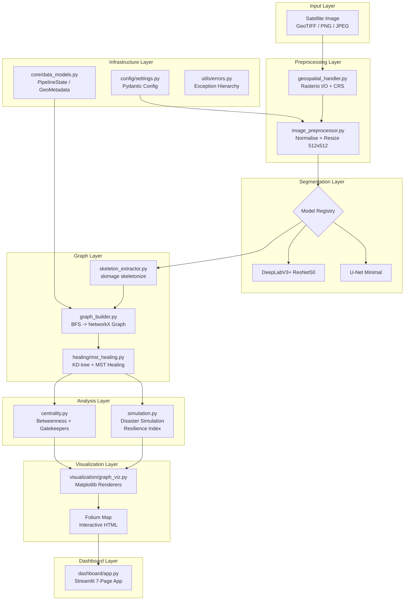
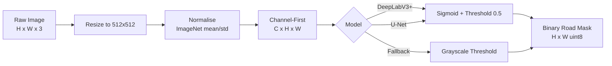
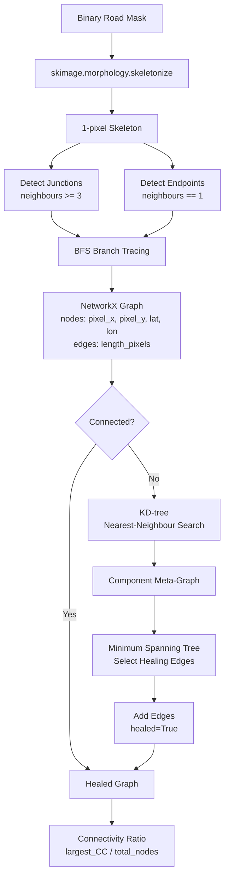
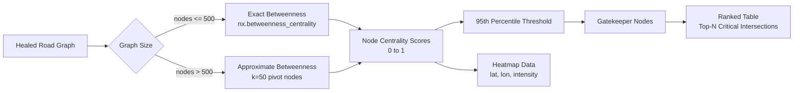
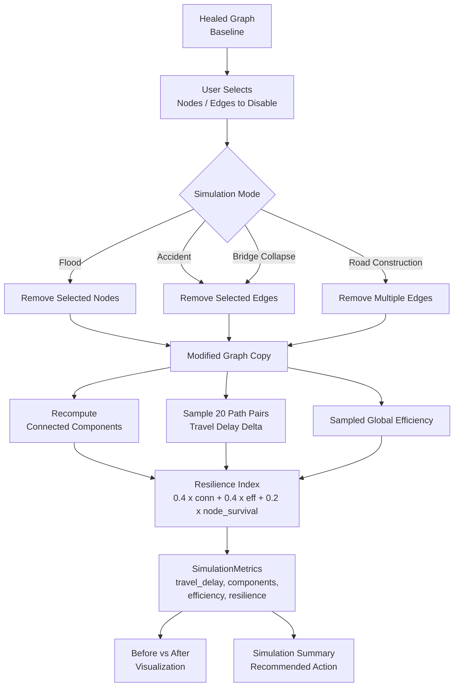
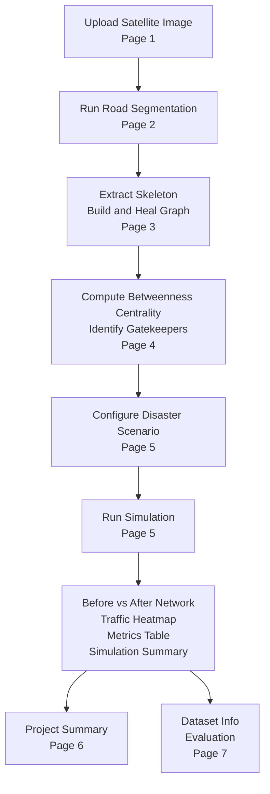

# Route Resilience

**AI-Powered Occlusion-Robust Road Extraction and Graph-Theoretic Urban Road Intelligence**

*Built for the ISRO Bharatiya Antariksh Hackathon*

---

[](https://route-resilience-.streamlit.app)
&nbsp;
[](https://drive.google.com/file/d/16VCMBuvki1lt9ZxLm6dAgAjEG8zhrX2x/view?usp=drive_link)
&nbsp;
[](https://github.com/jayjit-2025/Route-Resilience-)

---


</div>

---

## Table of Contents

- [What is Route Resilience?](#what-is-route-resilience)
- [Problem Statement](#problem-statement)
- [Objectives](#objectives)
- [Our Solution](#our-solution)
- [Existing Solutions vs Our Solution](#existing-solutions-vs-our-solution)
- [System Architecture](#system-architecture)
- [Pipelines](#pipelines)
  - [Segmentation Pipeline](#segmentation-pipeline)
  - [Graph Reconstruction and Healing Pipeline](#graph-reconstruction-and-healing-pipeline)
  - [Centrality and Bottleneck Detection Pipeline](#centrality-and-bottleneck-detection-pipeline)
  - [Disaster Simulation and Resilience Pipeline](#disaster-simulation-and-resilience-pipeline)
  - [End-to-End Demo Workflow Pipeline](#end-to-end-demo-workflow-pipeline)
- [Demo Workflow](#demo-workflow)
- [Key Features](#key-features)
- [Target Users and Value Metrics](#target-users-and-value-metrics)
- [Uses of AI](#uses-of-ai)
- [Tech Stack](#tech-stack)
- [Project Structure](#project-structure)
- [Evaluation Metrics](#evaluation-metrics)
- [Dataset Setup](#dataset-setup)
- [Quick Setup](#quick-setup)
- [Roadmap](#roadmap)
- [License](#license)

---

## What is Route Resilience?

Route Resilience is an end-to-end system that extracts road networks from satellite imagery under real-world occlusion conditions — including tree canopy, shadows, cloud cover, and parked vehicles — and converts the resulting segmentation mask into a mathematically routable, topologically correct road graph. The system then applies graph-theoretic analysis to identify critical bottleneck intersections and simulate the systemic impact of infrastructure failures such as floods, accidents, or bridge collapses, producing a quantitative Resilience Index for urban planners and disaster-response coordinators.

---

## Problem Statement

Satellite-based road extraction pipelines fail under occlusion. Standard semantic segmentation models produce fragmented binary masks when roads are obscured by vegetation, shadows, or weather, making the output unsuitable for routing or network analysis. Even when masks are accurate, converting them to a routable graph is non-trivial: pixel-level skeletonization produces disconnected components that break shortest-path queries. Current commercial tools either ignore these gaps or require expensive manual correction.

Beyond extraction, no open tool provides an integrated decision-support layer that answers: "If this intersection floods, how does travel time increase across the city, and which corridors become isolated?" Urban planners and emergency responders currently lack this capability at the speed and spatial resolution that satellite imagery allows.

Route Resilience addresses all three gaps — occlusion-robust extraction, topological graph healing, and interactive resilience simulation — in a single, fully open-source pipeline.

---

## Objectives

- Extract road centerlines from Sentinel-2, Cartosat-3, SpaceNet, and DeepGlobe imagery under occlusion conditions (trees, shadows, clouds, vehicles).
- Convert binary road masks into one-pixel-wide skeletons and then into weighted, routable NetworkX graphs with geospatial node coordinates.
- Heal fragmented graphs using a KD-tree-accelerated Minimum Spanning Tree algorithm that maximises the Connectivity Ratio (nodes in largest component / total nodes).
- Identify high-betweenness-centrality "Gatekeeper Nodes" that act as single points of failure in the road network.
- Simulate node and edge failures (flood, accident, bridge collapse, road construction) and compute Travel Delay, Network Efficiency, and a composite Resilience Index.
- Deliver all results through a seven-page interactive Streamlit dashboard with Folium map visualisations.
- Support training and validation against SpaceNet Roads, DeepGlobe Road Extraction, OpenSatMap, and OpenStreetMap ground-truth vectors.

---

## Our Solution

The system is structured as a modular, plugin-based pipeline. A satellite image enters the preprocessing stage where it is normalised and resized to 512 x 512. A DeepLabV3+ or U-Net segmentation model (with pretrained ImageNet backbone) produces a binary road mask. The mask is skeletonised using scikit-image's morphological thinning; junction and endpoint pixels are detected by analysing 8-connected neighbourhood counts. A BFS-based graph builder traces skeleton branches and creates a NetworkX graph where nodes carry pixel and geographic coordinates and edges carry Euclidean-distance weights.

Because segmentation under occlusion typically produces disconnected components, a graph healer applies a KD-tree nearest-neighbour search to find the cheapest inter-component connections and selects the minimum set of healing edges via an MST over a component meta-graph. The healed graph then undergoes betweenness centrality analysis (exact or k-sample approximate for large graphs) to rank nodes by their importance to overall network flow. Finally, a disaster simulator allows the user to remove any subset of nodes or edges and instantly recomputes connected components, average path length, global network efficiency, and a weighted Resilience Index. All stages are orchestrated through a Streamlit dashboard with before/after graph visualisations, a traffic redistribution heatmap, and export functionality.

---

## Existing Solutions vs Our Solution

| Aspect | Conventional Approaches | Route Resilience |
|---|---|---|
| Occlusion handling | Standard segmentation fails under tree canopy, shadows, and cloud cover; outputs noisy or broken masks | DeepLabV3+/U-Net with ImageNet pretraining; grayscale-threshold fallback ensures pipeline never breaks |
| Topological correctness | Pixel masks are not routable; graph conversion tools are separate, poorly integrated products | End-to-end: mask -> skeleton -> BFS graph builder -> NetworkX graph with weighted edges and geospatial coordinates |
| Graph healing | Disconnected components are silently ignored or require manual intervention | KD-tree MST healing automatically reconnects fragments; Connectivity Ratio reported before and after |
| Resilience analysis | No open integrated tool; commercial GIS platforms require manual setup per scenario | Interactive four-mode disaster simulator (flood, accident, bridge collapse, road construction); Resilience Index computed in under two seconds |
| Dashboard and interpretability | Results require GIS expertise to interpret | Seven-page Streamlit dashboard; before/after network visualisation; traffic heatmap; simulation summary with recommended action |
| Dataset independence | Tools are tightly coupled to one data source | DatasetFactory supports SpaceNet, DeepGlobe, OpenSatMap, OSM, and combined loading through a unified interface |

---

## System Architecture



---

## Pipelines

### Segmentation Pipeline

The preprocessing stage normalises pixel values to [0, 1], applies ImageNet mean/std normalisation, and converts to channel-first format (C, H, W) for PyTorch. The segmentation model returns a binary road mask at the same spatial resolution, resized back to the original image dimensions for downstream display.



### Graph Reconstruction and Healing Pipeline



### Centrality and Bottleneck Detection Pipeline

For graphs with more than 500 nodes, k-sample approximate betweenness centrality is used (default k=50) to keep computation under 30 seconds. Exact betweenness is available for smaller graphs.



### Disaster Simulation and Resilience Pipeline



### End-to-End Demo Workflow Pipeline



---

## Demo Workflow

The following steps describe the full demonstration sequence. Image placeholders reference files to be placed in `assets/demo/`.

**Step 1 — Upload Satellite Image**

Navigate to Page 1. Upload a GeoTIFF, PNG, or JPEG satellite tile. The dashboard displays the original image alongside a preprocessed (normalised) preview and reports whether geospatial metadata (CRS) was detected.


**Step 2 — Road Detection**

Navigate to Page 2. Adjust the segmentation threshold slider (default 0.5) and click "Run Road Segmentation". The dashboard shows the original image, the binary road mask, and a red-overlay composite.


**Step 3 — Road Reconstruction**

Navigate to Page 3. Click "Extract Skeleton and Build Graph". The pipeline runs skeletonisation, graph construction, and MST healing. The dashboard renders the raw graph and healed graph using actual pixel coordinates (no random layout), highlights recovered edges in green, and reports the Connectivity Ratio before and after healing.


**Step 4 — Critical Bottleneck Detection**

Navigate to Page 4. Click "Compute Betweenness Centrality". The top-10 Gatekeeper Nodes are listed by centrality score. A centrality heatmap is rendered on the Folium map when geospatial coordinates are available.


**Step 5 — Disaster Simulation**

Navigate to Page 5. Select a simulation mode (Flood, Accident, Bridge Collapse, or Road Construction). Choose nodes or edges to disable using the quick-select buttons (Critical Node, Random Node, Top 3 Gatekeepers) or the multiselect widget. Click "Run Simulation". The dashboard renders a before/after network comparison with disconnected regions highlighted in purple, a traffic redistribution heatmap, a full metrics table, and an auto-generated simulation summary card with recommended action.


**Step 6 — Project Summary**

Navigate to Page 6. All pipeline outputs are presented side by side with the full performance metrics table for evaluation by judges.


**Step 7 — Dataset Info and Evaluation**

Navigate to Page 7. Configure dataset paths, view the augmentation pipeline, and run evaluation against an uploaded ground-truth mask to compute IoU, Dice, and Relaxed IoU.


**Expected asset filenames:**

```
assets/
  demo/
    01_upload_image.png
    02_road_detection.png
    03_road_reconstruction.png
    04_critical_bottlenecks.png
    05_simulation_controls.png
    05_network_before_after.png
    05_traffic_heatmap.png
    05_metrics_summary.png
    06_project_summary.png
    07_dataset_info.png
  architecture/
    system_architecture.png
```

---

## Key Features

| Feature | Description |
|---|---|
| Occlusion-robust segmentation | DeepLabV3+ with ResNet-50 backbone and U-Net alternative; graceful grayscale-threshold fallback when PyTorch is unavailable |
| Skeleton extraction | scikit-image morphological thinning; junction detection (8-connected neighbours >= 3) and endpoint detection (neighbours == 1) |
| Graph construction | BFS branch tracing from junction/endpoint pixels; nodes carry pixel_x, pixel_y, lat, lon; edges carry length_pixels and length_meters |
| MST graph healing | KD-tree nearest-neighbour search across disconnected components; MST over component meta-graph selects minimum healing edges; Connectivity Ratio reported |
| Betweenness centrality | Exact (small graphs) or k-sample approximate (large graphs); configurable percentile threshold; Gatekeeper Node identification and ranking |
| Disaster simulation | Four modes: Flood, Accident, Bridge Collapse, Road Construction; computes Travel Delay, Connected Components, Network Efficiency, Resilience Index |
| Interactive dashboard | Seven-page Streamlit application; before/after visualisation; traffic redistribution heatmap; export to PNG, CSV, and TXT |
| Dataset support | DatasetFactory with loaders for SpaceNet Roads, DeepGlobe Road Extraction, OpenSatMap, and OSM (auto-mask via OSMnx); augmentation pipeline with cloud and shadow simulation |

---

## Target Users and Value Metrics

| User | Primary Use Case | Key Value Metric |
|---|---|---|
| Urban planners | Identify single-point-of-failure intersections before infrastructure investment | Gatekeeper Node rank, Resilience Index |
| Disaster response agencies | Pre-position resources based on which roads fail under flood or earthquake | Travel Delay delta, Connected Components after failure |
| ISRO and geospatial analysts | Extract routable road networks from Cartosat-3 and Sentinel-2 without manual digitisation | IoU, Dice Score, Connectivity Ratio |
| Municipality traffic engineers | Evaluate impact of planned road closures (construction, events) on city-wide travel time | Network Efficiency, Resilience Index |
| Researchers | Benchmark road extraction models against SpaceNet and DeepGlobe ground truth | Relaxed IoU, Topological Accuracy |

---

## Uses of AI

| Component | Technology | Type |
|---|---|---|
| Road segmentation | DeepLabV3+ with ResNet-50 backbone, pretrained on ImageNet | Deep learning — convolutional semantic segmentation |
| Road segmentation alternative | U-Net (minimal built-in or segmentation-models-pytorch with ResNet-34 encoder) | Deep learning — encoder-decoder segmentation |
| Occlusion inference | Atrous spatial pyramid pooling in DeepLabV3+ captures multi-scale context; graceful under shadows, tree canopy, cloud partial cover | Deep learning — multi-scale feature aggregation |
| Approximate betweenness centrality | k-sample pivot approximation via NetworkX; trades accuracy for speed on large graphs | Classical graph algorithm with configurable approximation |
| Graph healing | KD-tree spatial indexing + Kruskal MST on component meta-graph | Classical algorithm (no ML) |
| Disaster simulation | Graph modification + shortest-path sampling; Resilience Index as weighted combination of connectivity, efficiency, and node survival | Classical graph analysis (no ML) |
| Augmentation (training) | Random horizontal/vertical flip, rotation, crop, colour jitter, simulated cloud occlusion patches, simulated shadow polygons | Rule-based data augmentation applied during dataset loading |

The system is honest about the boundary between ML and classical components. The segmentation stage is the only true deep-learning component. Graph healing, centrality, and simulation are classical graph algorithms implemented in NetworkX and SciPy.

---

## Tech Stack

| Category | Library / Tool | Version | Purpose |
|---|---|---|---|
| Language | Python | 3.10+ | All modules |
| Deep learning | PyTorch + torchvision | 2.0+ (optional) | Segmentation model inference |
| Graph processing | NetworkX | 3.0+ | Graph construction, centrality, simulation |
| Geospatial raster I/O | Rasterio | 1.3+ | GeoTIFF reading, CRS handling, affine transforms |
| Geospatial system | GDAL (libgdal-dev) | 3.0+ | Rasterio backend; installed via packages.txt |
| Image processing | OpenCV (headless) | 4.8+ | Resize, normalise, mask overlay |
| Skeletonisation | scikit-image | 0.21+ | Morphological thinning |
| Scientific computing | SciPy | 1.11+ | KD-tree spatial indexing for graph healing |
| Numerical | NumPy | 1.24+ | Array operations throughout pipeline |
| Web dashboard | Streamlit | 1.28+ | Seven-page interactive application |
| Map visualisation | Folium | 0.14+ | Leaflet.js interactive maps with heatmap plugin |
| Graph rendering | Matplotlib | 3.7+ | Before/after graph PNG generation |
| Configuration | Pydantic | 2.0+ | Type-safe settings with validation |
| Config files | PyYAML | 6.0+ | YAML config loading |
| Data handling | Pandas, PyArrow, Pillow | 1.5+, 7.0+, 9.0+ | Metrics tables, Streamlit data display, image I/O |

---

## Project Structure

```
Route-Resilience/
|
|-- analysis/                  # Centrality analysis and disaster simulation
|   |-- centrality.py          # Betweenness centrality, Gatekeeper identification, heatmap data
|   `-- simulation.py          # Disaster simulator, travel delay, Resilience Index
|
|-- config/                    # Configuration management
|   |-- settings.py            # Pydantic Settings: ModelConfig, PreprocessingConfig, GraphHealingConfig, CentralityConfig
|   `-- default_config.yaml    # Default parameter values
|
|-- core/                      # Shared interfaces and data models
|   |-- interfaces.py          # Protocol definitions for all plugin components
|   `-- data_models.py         # PipelineState, GeoMetadata, CentralityResult, SimulationMetrics, RenderConfig
|
|-- dashboard/                 # Streamlit application
|   `-- app.py                 # Seven-page interactive dashboard (upload, detect, reconstruct, bottlenecks, simulate, summary, datasets)
|
|-- datasets/                  # Dataset loaders and augmentation
|   |-- base.py                # Abstract BaseRoadDataset with caching
|   |-- spacenet.py            # SpaceNet Roads loader
|   |-- deepglobe.py           # DeepGlobe Road Extraction loader
|   |-- opensatmap.py          # OpenSatMap loader
|   |-- osm_dataset.py         # OSM auto-mask generation via OSMnx (planned full integration)
|   |-- torch_dataset.py       # PyTorch Dataset and DataLoader wrappers
|   |-- transforms.py          # Augmentation: flip, crop, jitter, cloud/shadow simulation, normalise
|   |-- factory.py             # DatasetFactory: unified loader for one or multiple datasets
|   `-- evaluation.py          # IoU, Dice, Relaxed IoU, Connectivity Ratio, Topological Accuracy
|
|-- graph/                     # Road graph construction and healing
|   |-- skeleton_extractor.py  # scikit-image skeletonisation, junction and endpoint detection
|   |-- graph_builder.py       # BFS skeleton-to-NetworkX graph with geospatial coordinates
|   |-- utils.py               # Graph validation and statistics
|   `-- healing/
|       `-- mst_healing.py     # KD-tree MST healing; compute_connectivity_ratio
|
|-- preprocessing/             # Image loading and preprocessing
|   |-- geospatial_handler.py  # Rasterio GeoTIFF loading, pixel-to-latlon, bounds
|   `-- image_preprocessor.py # Normalise, resize, channel-first conversion, postprocess mask
|
|-- segmentation/              # Road segmentation models
|   |-- base.py                # BaseSegmentationModel ABC with device selection and batch fallback
|   |-- deeplabv3_model.py     # DeepLabV3+ ResNet-50 wrapper; grayscale fallback when torch absent
|   |-- unet_model.py          # U-Net wrapper (segmentation-models-pytorch or minimal built-in)
|   `-- model_registry.py      # register_model decorator and get_model factory
|
|-- utils/                     # Shared utilities
|   `-- errors.py              # RouteResilienceError, ImageLoadError, InvalidImageFormatError, ModelWeightsNotFoundError
|
|-- visualization/             # Graph rendering
|   `-- graph_viz.py           # render_graph, render_overlay, render_simulation_comparison, render_traffic_heatmap
|
|-- Recons/                    # Demo screenshots and output images
|-- assets/                    # README assets (demo screenshots, architecture diagrams)
|-- test_foundation.py         # Smoke test: config, data models, error classes
|-- test_data_models.py        # Data model unit tests
|-- requirements.txt           # Python dependencies
|-- packages.txt               # System dependencies (libgdal-dev, gdal-bin)
`-- README.md                  # This file
```

---

## Evaluation Metrics

| Metric | Description | Source |
|---|---|---|
| IoU (Intersection over Union) | Pixel-level overlap between predicted and ground-truth road mask; strict version with no tolerance buffer | `datasets/evaluation.py` |
| Dice Score | F1-like overlap metric; less sensitive to class imbalance than IoU | `datasets/evaluation.py` |
| Relaxed IoU | IoU with a 3-pixel tolerance buffer around ground-truth roads; penalises misalignment less than pixel-exact IoU | `datasets/evaluation.py` |
| Connectivity Ratio | Fraction of nodes in the largest connected component after graph healing; target >= 0.85 | `graph/healing/mst_healing.py` |
| Topological Accuracy | Mean relative path-length error between predicted graph and OSM ground-truth graph, sampled over random node pairs | `datasets/evaluation.py` |
| Resilience Index | Composite score [0, 1] weighting connectivity preservation (40%), network efficiency retention (40%), and node survival rate (20%) after simulated failure | `analysis/simulation.py` |

---

## Dataset Setup

| Dataset | Source | Format |
|---|---|---|
| SpaceNet Roads | https://spacenet.ai/roads/ | GeoTIFF images in `images/`, binary masks in `masks/` |
| DeepGlobe Road Extraction | https://competitions.codalab.org/competitions/18467 | `<id>_sat.jpg` and `<id>_mask.png` flat layout |
| OpenSatMap | https://opensatmap.github.io/ | PNG images in `images/`, labels in `labels/` |
| OSM ground truth | Auto-fetched via OSMnx for georeferenced GeoTIFF input | Rasterised from OSM road vectors; cached to `.cache/datasets/osm_masks/` |

Place each dataset at the path you configure in the Dashboard Dataset Info page, or pass paths directly to `DatasetConfig`:

```python
from datasets.factory import DatasetFactory, DatasetConfig

cfg = DatasetConfig(
    active="deepglobe",
    deepglobe_root="datasets/deepglobe",
    target_size=(512, 512),
    augment=True,
)
factory = DatasetFactory(cfg)
train_loader = factory.get_dataloader("train")
```

The `DatasetFactory` supports `active="combined"` to merge all configured datasets into a single loader.

---

## Quick Setup

```bash
# 1. Clone the repository
git clone https://github.com/jayjit-2025/Route-Resilience-.git
cd Route-Resilience-

# 2. Install system dependencies (Linux / Streamlit Cloud)
sudo apt-get install -y libgdal-dev gdal-bin
# On Windows: install OSGeo4W from https://trac.osgeo.org/osgeo4w/

# 3. Install Python dependencies
pip install -r requirements.txt

# 4. (Optional) Install PyTorch for DeepLabV3+ inference
# CPU only:
pip install torch torchvision --index-url https://download.pytorch.org/whl/cpu
# GPU (CUDA 11.8):
pip install torch torchvision --index-url https://download.pytorch.org/whl/cu118

# 5. Run the dashboard
python -m streamlit run dashboard/app.py

# 6. Open in browser
# http://localhost:8501
```

Without PyTorch installed, the segmentation stage falls back to a grayscale threshold. All graph construction, healing, centrality analysis, and disaster simulation features operate without PyTorch.

---

## Roadmap

The following improvements are planned for post-hackathon development, prioritised by impact.

### Near-Term (1-3 months)

| Item | Description |
|---|---|
| Fine-tuned segmentation weights | Train DeepLabV3+ end-to-end on SpaceNet Roads and DeepGlobe with the cloud/shadow augmentation pipeline already implemented in `datasets/transforms.py` |
| Transformer-based segmentation | Integrate SegFormer or Swin-UNet as a third plugin implementing the `RoadSegmentationModel` protocol |
| Georeferenced map overlay | Complete Folium satellite image overlay for GeoTIFF inputs; currently requires geospatial metadata |
| OSM ground-truth validation | Full integration of `datasets/osm_dataset.py` for automatic mask generation and topological accuracy benchmarking |
| Export to GeoJSON / Shapefile | Allow healed road graphs to be exported as standard GIS vector formats for use in QGIS and ArcGIS |

### Medium-Term (3-6 months)

| Item | Description |
|---|---|
| Multi-temporal change detection | Compare road networks extracted from image pairs across time to detect infrastructure damage or new construction |
| Graph Neural Network healing | Replace MST healing with a GNN trained to predict missing road segments from image context |
| REST API | Expose the pipeline as a FastAPI service for integration with external planning tools |
| Cartosat-3 native support | Optimise preprocessing and model fine-tuning for Cartosat-3 high-resolution imagery provided by ISRO |
| Performance benchmarking suite | Automated benchmark runner comparing IoU, Connectivity Ratio, and Topological Accuracy across all supported datasets |

### Long-Term (6+ months)

| Item | Description |
|---|---|
| City-scale processing | Tile-based distributed processing for entire city or district-level imagery using Apache Spark or Dask |
| Real-time disaster integration | Live ingestion of satellite imagery during disaster events with automated resilience alerts |
| Multi-modal transport networks | Extend graph analysis to include pedestrian paths, railways, and waterways for complete urban mobility modelling |
| Federated learning | Collaborative model training across organisations without sharing raw satellite imagery |
| ISRO Bhuvan integration | Direct data ingestion from ISRO Bhuvan geoportal APIs |

---

## License

This project is released under the **MIT License**.

```
MIT License

Copyright (c) 2025 Jayjit Dutta

Permission is hereby granted, free of charge, to any person obtaining a copy
of this software and associated documentation files (the "Software"), to deal
in the Software without restriction, including without limitation the rights
to use, copy, modify, merge, publish, distribute, sublicense, and/or sell
copies of the Software, and to permit persons to whom the Software is
furnished to do so, subject to the following conditions:

The above copyright notice and this permission notice shall be included in all
copies or substantial portions of the Software.

THE SOFTWARE IS PROVIDED "AS IS", WITHOUT WARRANTY OF ANY KIND, EXPRESS OR
IMPLIED, INCLUDING BUT NOT LIMITED TO THE WARRANTIES OF MERCHANTABILITY,
FITNESS FOR A PARTICULAR PURPOSE AND NONINFRINGEMENT. IN NO EVENT SHALL THE
AUTHORS OR COPYRIGHT HOLDERS BE LIABLE FOR ANY CLAIM, DAMAGES OR OTHER
LIABILITY, WHETHER IN AN ACTION OF CONTRACT, TORT OR OTHERWISE, ARISING FROM,
OUT OF OR IN CONNECTION WITH THE SOFTWARE OR THE USE OR OTHER DEALINGS IN THE
SOFTWARE.
```

See the [LICENSE](LICENSE) file for full details.

---

<div align="center">
Built for the ISRO Bharatiya Antariksh Hackathon 2025
</div>
